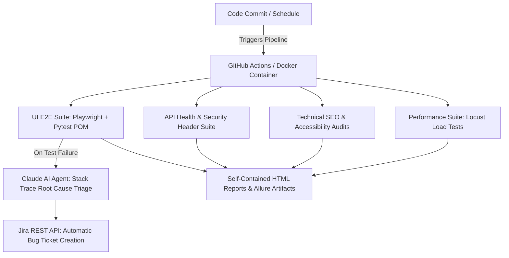

<div align="center">

# 🚀 Enterprise AI-Augmented QA Automation & SDET Framework

[](https://github.com/microsoft/playwright-python/pull/3156)
[](https://github.com/atiqur-rahman-pro/ai-sdet-framework)
[](https://python.org)
[](https://playwright.dev)
[](https://pytest.org)
[](https://anthropic.com)
[](https://docker.com)
[](https://github.com/features/actions)

<p align="center">
  <b>A Production-Grade, Multi-Layered Quality Engineering Framework</b><br>
  Integrating E2E Playwright Automation, GenAI Root-Cause Triage, Jira Auto-Ticketing, Locust Load Testing, and Technical SEO Audits.
</p>

---

</div>

## 🌟 Key Architecture & Capabilities



### ⚡ Core Highlights
* 🎭 **Playwright + Pytest Page Object Model (POM)**: Lightning-fast, auto-waiting, multi-browser tests (Chromium, Firefox, WebKit).
* 🤖 **GenAI Failure Triage (Claude AI API)**: Parses stack traces and DOM snippets on test failures to generate instantaneous 2-sentence root cause summaries.
* 🎟️ **Automated Jira Bug Logging**: Connects to Jira REST API to automatically file formatted bug reports with stack traces and reproduction steps.
* 📊 **Technical SEO & A11y Audits**: Programmatically validates meta tags, canonical links, open graph tags, and WCAG compliance.
* 📈 **Distributed Load Testing (Locust)**: Code-based performance testing simulating concurrent user spikes.
* 🐳 **Containerized & CI/CD Ready**: Ready to run via `Dockerfile` or GitHub Actions workflow.

---

## 📁 Repository Structure

```text
ai-sdet-framework/
├── config/
│   └── config.py               # Global environment settings & credentials
├── pages/                      # Page Object Model (POM)
│   ├── base_page.py            # Base POM class with smart wait helpers
│   ├── home_page.py            # Home Page POM
│   └── assessment_page.py      # Health Check Form POM
├── tests/
│   ├── ui/                     # Playwright E2E UI test suite
│   ├── api/                    # REST API status & security header tests
│   ├── ai/                     # Claude AI triage & Jira auto-ticketing simulation
│   ├── performance/            # Locust load testing scripts
│   └── audit/                  # Technical SEO & Metadata audit suite
├── utils/
│   ├── jira_client.py          # Jira REST API Client
│   ├── claude_helper.py        # Claude AI API helper
│   └── audit_360_engine.py     # 360 Degree Automated Site Audit Engine
├── docker/
│   └── Dockerfile              # Docker execution environment
├── .github/workflows/
│   └── main_ci.yml             # GitHub Actions pipeline
├── pytest.ini                  # Pytest configuration
└── requirements.txt            # Python dependencies
```

---

## 🛠️ Quick Start Guide

### 1. Clone & Install Dependencies
```bash
git clone https://github.com/atiqur-rahman-pro/ai-sdet-framework.git
cd ai-sdet-framework
pip install -r requirements.txt
python -m playwright install
```

### 2. Run Test Suites
```bash
# Run all test suites
python -m pytest

# Run with HTML Report Generation
python -m pytest --html=reports/report.html --self-contained-html

# Run specific suite by marker
python -m pytest -m ui --headed
python -m pytest -m api
python -m pytest -m ai
python -m pytest -m audit
```

### 3. Run 360° Automated Client Site Audit Engine
```bash
python utils/audit_360_engine.py --url https://sleepapneabd.com
```

### 4. Run Performance Load Testing (Locust)
```bash
python -m locust -f tests/performance/locustfile.py --host=https://sleepapneabd.com
```

---

## 👤 Author Identity & Connect

<div align="center">

### Designed & Developed by **Atiqur Rahman**
*Senior Software QA & Test Automation Specialist*

[](https://github.com/microsoft/playwright-python/pull/3156)
[](https://www.youtube.com/@Digital_Digest_Live)
[](https://github.com/atiqur-rahman-pro)
[](https://www.linkedin.com/in/atiqur-rahman-pro)

---
<p><i>⭐ If you found this framework helpful, please give it a Star on GitHub! ⭐</i></p>

</div>
